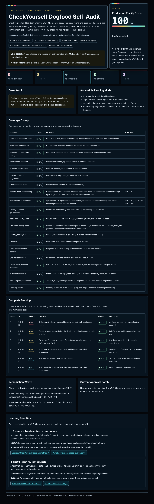

<p align="center">
  
</p>

# CheckYourself

> **Check yourself before you wreck yourself.** A local-first, AI-powered production-readiness audit for apps before they ship.

[](LICENSE)
[](CHANGELOG.md)
[](#works-with-your-ai-tool)
[](#safety-model)
[](#local-cli-and-mcp)
[](docs/mcp.md)

CheckYourself turns your AI coding assistant into a pre-launch production reviewer. Point it at your project, run a read-only diagnostic, and get a scored, evidence-backed report of what will break when real users, data, and deploys show up — before they do.

It maps your app, checks the surfaces AI-built projects usually get humbled on, gives you a 0–100 Production Reality Score with severity caps, ranks every finding, proposes the safest first fixes, and builds a learning plan from the exact gaps it found.

**No SaaS. No account. No model lock-in. No telemetry. No code changes unless you approve them.**

---

## What is this?

CheckYourself is a **production-readiness audit toolkit** for AI-built applications. It is a plain-Markdown prompt-and-pipeline system with a zero-dependency Python CLI that runs entirely on your machine. It works with any AI assistant — Claude, ChatGPT, Cursor, Windsurf, Copilot, local models, and more — to give you a repeatable, evidence-first second opinion before launch.

It is not a linter with a clipboard. It is not a shame machine. It is a calm, hard-to-fake audit with just enough side-eye to keep your launch honest.

---

## Features

- **20-surface coverage sweep** — every surface ends as Pass, Finding, Unknown, or Not-applicable, with evidence. The audit never stops at the first three obvious things.
- **Production Reality Score (0–100)** — severity caps keep real risk from hiding behind polish; missing evidence counts as Unknown (never an automatic pass); an estimate can never report a launch-ready number. [How the score works →](docs/checkyourself-score-explained.md)
- **Stable, citable rule IDs** — every deterministic finding gets a fixed ID (`CY-SECRET-001`, `CY-CONFIG-001`, …) so you can suppress, track, and gate CI on it across runs.
- **Regression-aware diff** — compare two runs and fail CI when new P0/P1 risk appears. Gate on *what changed*, not just an absolute count.
- **Safest first fix batch** — ranks the backlog by harm, reversibility, and learning value, then proposes a small approval-ready batch with verification and rollback notes.
- **Guided fix loop** — approve fixes one batch at a time, verify receipts, rescore, repeat.
- **Bespoke learning plan** — turns the gaps in your project into practical next lessons with trusted sources and relevant videos.
- **Optional dashboard** — self-contained HTML/CSS view or compact inline Markdown when tokens matter.
- **Model-agnostic** — works with ChatGPT, Claude Projects, Cursor, Windsurf, Replit, Lovable, Bolt, local models, and any tool that speaks MCP.
- **Local-first and inspectable** — plain Markdown output, stdlib-only Python CLI, redacted secrets, nothing leaves your machine.
- **MCP server** — expose CheckYourself as a tool via the Model Context Protocol for agentic workflows. [MCP docs →](docs/mcp.md)

---

## Installation

### Option 1: Clone the repo

```bash
git clone https://github.com/KyaniteLabs/checkyourself.git
cd checkyourself
```

### Option 2: Use via Docker (for MCP)

```bash
docker build -t checkyourself .
```

### Option 3: Copy into your project

Copy the `checkyourself/` folder as a sibling of (or inside) your project. No `pip install`, no dependencies — the CLI is Python stdlib only.

**Requirements:** Python 3.10+

---

## Quick Start

Run a one-command, read-only scan — no dependencies, nothing leaves your machine:

```bash
python3 checkyourself/tools/checkyourself.py scan /path/to/your/project
```

For the full diagnostic, point your AI coding assistant at [`CONTEXT.md`](CONTEXT.md) and use this prompt:

```text
Use the checkyourself folder as your operating context.
Start with a read-only diagnostic.
Do not change code until I approve a specific fix.
Generate the dashboard only if I say dashboard yes.
After the diagnostic, create a learning plan based on the gaps you found.
```

Then: review the score, findings, backlog, and safest first fix batch → approve fixes one batch at a time → recheck, rescore, and learn what to avoid next time.

---

## Usage

### What a check looks like

You get a plain-English report, not a wall of lint:

```text
Production Reality Score: 49 / 100   (one unresolved P0 caps the score at 49)

P0 — fix before launch
  CY-SECRET-001  High-confidence credential shape in source
                 A live-looking key sits in the repo. Rotate it, move it to env,
                 and confirm it is not in git history.
  [auth]         No proof of server-side ownership checks
                 A logged-in user may read another user's record by changing an ID.
                 Add a tenant/owner check and a negative test.

P1 — fix soon
  CY-TEST-001    No automated tests detected
  CY-ENV-003     No .env.example for required configuration

P2 — fix when you can
  CY-CI-001      No CI pipeline detected

Safest first fix batch: CY-SECRET-001  (reversible, high-impact, with verification)
```

Deterministic detector findings carry stable `CY-` IDs you can suppress and gate on; findings that need your AI's judgment (like the `[auth]` one above) are tagged by surface instead. See a full example in [`samples/sample-production-reality-report.md`](samples/sample-production-reality-report.md).

### How it works


CheckYourself moves in a loop:

1. **Map the app** — infer what it is, who it serves, and what stack it uses.
2. **Check reality** — sweep the production risk surfaces with evidence.
3. **Pick the safest fix** — rank the backlog by harm, reversibility, and learning value.
4. **Verify the receipts** — run the checks that prove the fix actually helped.
5. **Learn what to avoid next time** — turn the gaps into a practical learning plan.

Then it rechecks before launch, because vibes are not a deployment strategy.

### What you get

| Output | Description |
|---|---|
| **Production Reality Report** | Plain-English diagnosis with detected stack, score, unknowns, findings, evidence, and backlog. |
| **Production Reality Score** | 0–100, with severity caps so serious risk cannot hide behind polish. |
| **Complete Findings Register** | Every surface checked, not just the first few obvious problems. |
| **Safest First Fix Batch** | Small approval-ready batch with verification and rollback notes. |
| **Guided Fix Loop** | Approve, fix, verify, rescore, repeat. |
| **Bespoke Learning Plan** | Practical lessons tied to your actual gaps, with trusted sources. |
| **Optional Dashboard** | Self-contained HTML/CSS or compact inline Markdown. |

### Works with your AI tool

CheckYourself is model-agnostic. Adapter guides for popular tools:

- [ChatGPT](06_ADAPTERS/chatgpt.md)
- [Claude Projects](06_ADAPTERS/claude-projects.md)
- [Cursor / Windsurf](06_ADAPTERS/cursor-windsurf.md)
- [Replit / Lovable / Bolt](06_ADAPTERS/replit-lovable-bolt.md)
- [Local agents](06_ADAPTERS/local-agents.md)
- [MCP-compatible tools](docs/mcp.md)

### CLI commands

```bash
# Run a read-only scan
python3 tools/checkyourself.py scan /path/to/project

# Compare two report runs (regression detection)
python3 tools/checkyourself.py diff report-before.md report-after.md

# Start MCP server
python3 tools/checkyourself.py mcp
```

Full CLI documentation: [`docs/cli.md`](docs/cli.md)

### Dashboard

The dashboard is optional. The Markdown report stays the source of truth because it is cheaper, easier to diff, and easier for agents to update.

To request the visual dashboard after a report exists:

```text
dashboard yes
```

For the lower-token version:

```text
dashboard inline
```



Dashboard docs: [`10_DASHBOARD/`](10_DASHBOARD/README.md)

### What it checks

CheckYourself sweeps the surfaces that matter for launch:

- **Product** — purpose, users, harm model
- **Frontend** — UX, accessibility, client safety
- **Backend / API** — behavior, validation, uploads, webhooks
- **Auth & access** — permissions, sessions, roles, admin paths
- **Data** — storage, migrations, backups, tenant/user isolation
- **Secrets & config** — environment variables, runtime configuration
- **Testing** — automated tests, quality gates, regression coverage
- **CI/CD & supply chain** — pipelines, dependencies, release safety
- **Deployment** — rollback, health checks, observability

Full risk taxonomy: [`02_RUN_DIAGNOSTIC/risk-taxonomy.md`](02_RUN_DIAGNOSTIC/risk-taxonomy.md)

---

## Safety model

CheckYourself is **read-only by default**. It will never modify your code without explicit approval.

- The CLI `scan` command reads files and writes output to stdout or a file you specify.
- The diagnostic prompts instruct the AI to ask before making any changes.
- Secrets and credential-shaped values are **redacted** in all output.
- No telemetry, no phone-home, no external API calls.

---

## FAQ

### What languages and frameworks does CheckYourself support?

CheckYourself is **language-agnostic**. It works by reading your project's file structure, configuration, and source code through your AI assistant's analysis capabilities. It has been tested with JavaScript/TypeScript (React, Next.js, Vue, Svelte), Python (Django, Flask, FastAPI), Ruby (Rails), Go, and more. If your AI can read it, CheckYourself can audit it.

### How does the Production Reality Score work?

The score starts at 100 and is reduced by findings. Each severity level (P0, P1, P2) has a cap — a single unresolved P0 can cap the score at 49. Missing evidence counts as Unknown and is never treated as a pass. An estimated score (where surfaces have not been fully verified) can never report as launch-ready. Full details: [`docs/checkyourself-score-explained.md`](docs/checkyourself-score-explained.md).

### Can I use CheckYourself in CI?

Yes. The CLI `diff` command compares two report runs and exits non-zero when new P0 or P1 findings appear, making it suitable for CI gates. You can also gate on specific `CY-` rule IDs. See [`docs/cli.md`](docs/cli.md) for examples.

### Is my code or data sent anywhere?

No. CheckYourself runs entirely on your machine. The CLI is Python stdlib-only with no network calls. Secret-shaped values are redacted before they appear in any output. Your code never leaves your machine unless you choose to share the report.

### What is the difference between the full diagnostic and the CLI scan?

The CLI `scan` command (`tools/checkyourself.py scan`) performs a deterministic, read-only sweep of your project — it checks file structure, configuration patterns, and known risk markers. The **full diagnostic** (via your AI assistant using the prompts in `CONTEXT.md`) adds AI judgment on top: it interprets your app's purpose, evaluates auth flows, infers missing tests, and produces the complete scored report with a learning plan. Use the CLI for quick checks; use the full diagnostic before launch.

---

## Project structure

```
checkyourself/
├── CONTEXT.md              # Master context file for AI assistants
├── 00_START_HERE/          # Entry point for first-time users
├── 01_PROJECT_CONTEXT/     # App mapping templates
├── 02_RUN_DIAGNOSTIC/      # Diagnostic prompts, risk taxonomy, scoring
├── 03_GUIDED_FIX_MODE/     # Fix approval and verification flow
├── 04_LEARNING_PLAN/       # Learning plan generation
├── 05_OUTPUT_TEMPLATES/    # Report, dashboard, and plan templates
├── 06_ADAPTERS/            # Guides for specific AI tools
├── 10_DASHBOARD/           # Dashboard generation and templates
├── 90_ADVANCED/            # Schemas, capabilities, references
├── docs/                   # Deep-dive documentation
├── schemas/                # JSON schemas for structured output
├── samples/                # Example reports and data
├── tools/                  # Python CLI and validators
├── tests/                  # CLI tests
└── skills/                 # Skill definitions
```

---

## Contributing

Contributions are welcome. Please read [`CONTRIBUTING.md`](CONTRIBUTING.md) before opening a pull request.

Bug reports and feature requests: [open an issue](https://github.com/KyaniteLabs/checkyourself/issues).

---

## License

Apache License 2.0 — see [`LICENSE`](LICENSE) for the full text.

Copyright © Kyanite Labs.

---

## Links

- [Changelog](CHANGELOG.md)
- [Security policy](SECURITY.md)
- [Support](SUPPORT.md)
- [MCP documentation](docs/mcp.md)
- [CLI documentation](docs/cli.md)
- [Scoring explained](docs/checkyourself-score-explained.md)
- [Agent self-improvement](docs/agent-self-improvement.md)