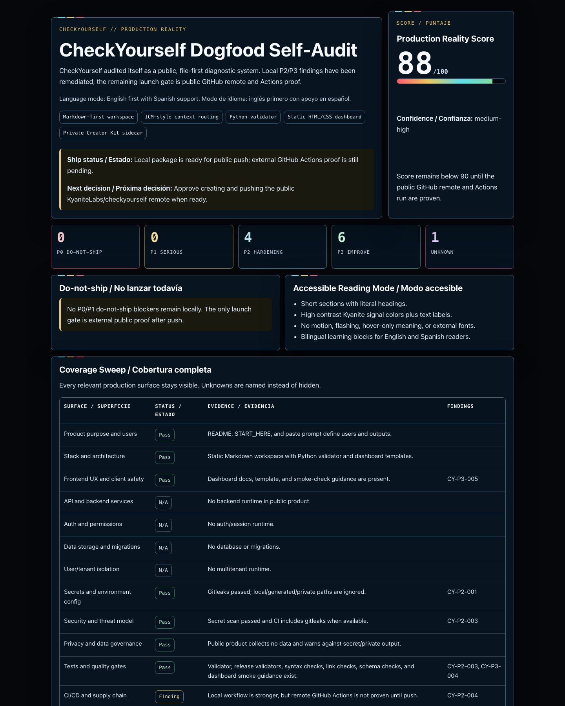

# CheckYourself — AI Production-Readiness Diagnostic for Apps Built With AI

**TL;DR:** CheckYourself — AI production-readiness diagnostic for apps built with AI. Best for founders and engineers shipping AI-generated apps.

> **Check yourself before you wreck yourself — for the apps you ship.** Before you launch it, CheckYourself.

[](LICENSE)
[](#works-with-every-ai-coding-tool)
[](90_ADVANCED/)
[](#is-it-safe-to-run-on-my-codebase)

**CheckYourself is a free, open-source, model-agnostic production-readiness system for apps built with AI coding assistants.** It turns any AI assistant — Cursor, Claude, ChatGPT, Gemini, Copilot, Windsurf, Replit, Lovable, Bolt, Codex, or a local agent — into a pre-launch auditor that inspects your app, infers the stack, finds production gaps, explains every risk in plain English, proposes fixes for your approval, verifies them, and then writes a learning plan built from the exact gaps your own project had.

Under the hood it is a complete, staged engineering system, not a single canned prompt: an ICM-style context workspace that routes the agent through each stage, an evidence-based 0–100 scoring method with severity caps, a 19-capability production-hardening engine spanning auth, data, secrets, CI/CD, observability, privacy, and AI governance, JSON output schemas, report and risk templates, and a public validation suite. You install it as your AI assistant's operating context — no SaaS, no account, no lock-in to any one model.

---

## Table of contents

- [What is CheckYourself?](#what-is-checkyourself)
- [Why it exists](#why-it-exists)
- [Get started](#get-started)
- [What it produces](#what-it-produces)
- [What it checks](#what-it-checks)
- [Works with every AI coding tool](#works-with-every-ai-coding-tool)
- [Who it is for](#who-it-is-for)
- [How it works](#how-it-works)
- [Optional local CLI](#optional-local-cli)
- [Optional visual dashboard](#optional-visual-dashboard)
- [Token efficiency by design](#token-efficiency-by-design)
- [Safety model](#safety-model)
- [FAQ](#faq)
- [License](#license)

---

## What is CheckYourself?

CheckYourself is an open-source **production-readiness audit system** — a structured, staged engineering framework of context files, scoring logic, output schemas, templates, and a deep production-hardening capability stack that you load as an AI coding assistant's operating context, so it can grade an AI-built app the way real production would: honestly, completely, and before launch.

It answers one question that matters to every "vibe coder," indie hacker, and AI-assisted builder: **"Is this app actually ready to ship, and if not, what exactly is wrong and how do I fix it?"**

Unlike a "top three issues" linter, CheckYourself builds a **complete findings register** and a **complete remediation backlog**, scores production readiness from 0–100, and walks you through fixes one safe, reversible batch at a time. When the audit is done, it generates a **bespoke learning plan** so you actually learn from what your project was missing.

It is also organized as an ICM-style context workspace: [`CONTEXT.md`](CONTEXT.md) routes the agent to staged folders, each major stage has its own `CONTEXT.md`, and durable handoff artifacts belong in stage `output/` folders. CheckYourself is not affiliated with the RinDig ICM project; it uses the same file-first idea so agents know what to read, do, and produce at each step.

---

## Why it exists

Apps built fast with AI tools tend to look finished long before they are safe to launch. The gaps are usually invisible from the happy path: missing auth checks, unvalidated inputs, leaked secrets, no backups, no rollback, no tests, no rate limits, no error tracking.

CheckYourself gives you reality **before production does the grading** — a calm, complete, plain-English second pass that any AI assistant can run on your behalf.

---

## Get started

1. Download or clone this repository.
2. Put the `checkyourself` folder in or next to your project.
3. Point your AI coding assistant at the folder as its **operating context**. Start at [`CONTEXT.md`](CONTEXT.md) — it routes the agent through each stage without loading the whole repo. New to the system? Read [`START_HERE.md`](START_HERE.md) first.
4. Run a read-only diagnostic and review the **Production Reality Report**.
5. Approve fixes one at a time or in safe, reversible batches.
6. Recheck and rescore after each batch.
7. Continue until every finding is fixed, deferred with a reason, accepted as risk, blocked by missing context, or proven not applicable.
8. Get a custom learning plan based on the actual gaps.

> **No model lock-in. No required cloud account. No command line.**

### Direct your assistant

Once the folder is in place, tell your AI assistant how to operate within it:

```text
Use the checkyourself folder as your operating context.
Start with a read-only diagnostic.
Do not make code changes until I approve a specific fix.
Generate the dashboard only if I say dashboard yes.
After the diagnostic, create a learning plan based on the gaps you found.
```

---

## Visual workflow


```text
Add the folder → run the audit → review the full backlog → approve fixes → verify → repeat → learn what you missed
```

CheckYourself is not a "top three issues" tool. It creates a complete findings register and a complete remediation backlog. The first approval batch is intentionally small so fixes stay safe, understandable, and reversible.

---

## What it produces

Default outputs (see a real example in [`samples/sample-production-reality-report.md`](samples/sample-production-reality-report.md)):

- **Project Map** — what your app appears to do.
- **Detected Stack** — framework, database, auth, hosting, tests, deployment signals, and confidence.
- **Production Reality Score** — a 0–100 score with caps and reasoning ([how the score works](docs/checkyourself-score-explained.md)).
- **Coverage Sweep** — every relevant production surface marked Pass, Finding, Unknown, or Not applicable.
- **Complete Findings Register** — every discovered risk, not just the obvious ones.
- **Complete Remediation Backlog** — every finding and blocking unknown ranked by severity, safety, and dependency order.
- **Safest First Approval Batch** — the first reversible batch to approve, not the whole scope.
- **Guided Fix Loop** — approve, fix, verify, rescore, repeat.
- **Bespoke Learning Plan** — what to learn next based on what your own app was missing.

Optional output:

- **Human Audit Dashboard** — one self-contained HTML/CSS dashboard that visualizes the score, risks, backlog, coverage, status, and learning plan. It is optional because dashboards use extra tokens. Ask for it with `dashboard yes`. If you do not want HTML, use the compact inline Markdown dashboard instead.

---

## What it checks

The diagnostic sweeps the whole relevant production surface:

- product purpose, users, and harm model;
- frontend UX, accessibility, and client safety;
- API/backend behavior, validation, uploads, and webhooks;
- auth, permissions, sessions, roles, and admin paths;
- data storage, migrations, backups, and tenant/user isolation;
- secrets, environment variables, and runtime configuration;
- tests, quality gates, and regression coverage;
- CI/CD, supply chain, dependencies, and release safety;
- deployment, rollback, hosting, and environments;
- observability, logs, errors, alerts, and incident response;
- performance, scaling, caching, and rate limits;
- privacy, compliance, data retention, and consent;
- AI/RAG/agent governance when applicable.

The full technical engine lives in [`90_ADVANCED/`](90_ADVANCED/), but users do not need to read it first.

---

## Works with every AI coding tool

CheckYourself is **model-agnostic** and ships as plain Markdown, so it runs in any AI assistant that can read text or files:

| Category | Tools |
| --- | --- |
| AI IDEs & editors | Cursor, Windsurf, GitHub Copilot, Codex |
| Chat assistants | ChatGPT, Claude, Gemini |
| App builders | Replit, Lovable, Bolt |
| Local & custom agents | any local model or agent that reads files |

Tool-specific setup guides live in [`06_ADAPTERS/`](06_ADAPTERS/README.md).

---

## Who it is for

CheckYourself is for people who build with AI and want reality before production does the grading:

- beginners learning by doing;
- intermediate builders who can ship but want a safer second pass;
- experienced developers who want a reusable audit context;
- AI-built app learners and community builders;
- Cursor, Windsurf, Replit, Lovable, Bolt, ChatGPT, Claude, Gemini, Codex, and local-agent users;
- founders, freelancers, agencies, and teams preparing real launches.

---

## How it works

CheckYourself runs as a staged workflow, each stage with its own context file so your AI tool always knows what to read, do, and produce:

1. **Project context** — the agent maps what your app does and detects the stack.
2. **Run diagnostic** — a read-only sweep produces the Production Reality Report and score.
3. **Guided fix mode** — you approve fixes in safe batches; the agent applies and verifies them.
4. **Learning plan** — the agent writes a plan from the real gaps it found.
5. **Dashboard (optional)** — a self-contained HTML or inline Markdown view of everything.

Each stage is defined by its own context files, scoring rules, schemas, and templates — so the agent always knows what to read, what to do, and what to produce. The advanced engine in [`90_ADVANCED/`](90_ADVANCED/) deepens any stage when a domain warrants it.

---

## Optional local CLI

For a zero-token head start, CheckYourself ships a small **optional** scan & scaffold CLI — standard library only, no network, no secret values printed:

```bash
python3 tools/checkyourself.py /path/to/your/project
```

It detects your stack, flags obvious deterministic risks (possible hardcoded secrets, a committed `.env`, missing `.env.example`, absent tests or CI) ranked P0–P3, and writes a pre-filled context file your AI can build on. Add `--json` for a machine-readable summary, `--format json --no-write` for JSON stdout, or `--ci` to use it as a lightweight pipeline gate (non-zero exit on a P0). The CLI is a scaffold, not a substitute — the AI still runs the full diagnostic. See [`docs/cli.md`](docs/cli.md).

The agent-access roadmap is CLI-first: no hosted API for the current open-source product, with MCP planned later as a thin native-agent wrapper. See [`docs/agent-access-cli-plan.md`](docs/agent-access-cli-plan.md).

---

## Optional visual dashboard

The Markdown report is the default output because it is cheaper, faster, and easier for most AI tools to produce.

This repository includes a real dogfood dashboard screenshot from CheckYourself auditing itself:



After the report exists, say:

```text
dashboard yes
```

The AI creates one self-contained HTML/CSS dashboard from the report — it should not re-run the audit just to make the dashboard. If you do not want HTML, ask for:

```text
dashboard inline
```

and the AI returns the compact Markdown dashboard shape instead of creating a file.

Dashboard files:

- [`10_DASHBOARD/README.md`](10_DASHBOARD/README.md)
- [`10_DASHBOARD/dashboard-data-contract.md`](10_DASHBOARD/dashboard-data-contract.md)
- [`10_DASHBOARD/inline-dashboard.md`](10_DASHBOARD/inline-dashboard.md)
- [`10_DASHBOARD/dashboard-prompt.md`](10_DASHBOARD/dashboard-prompt.md)
- [`10_DASHBOARD/dashboard-template.html`](10_DASHBOARD/dashboard-template.html)

---

## Token efficiency by design

CheckYourself uses progressive context loading so audits stay affordable even on large projects:

- Start with the stage context and coverage matrix.
- Load advanced files only when a domain is relevant.
- Keep the complete findings register compact.
- Expand details for P0/P1 items and the next approval batch.
- Do not paste long source files, logs, or reference docs back to the user.
- Generate the HTML dashboard only when the user asks for it.

See [`docs/token-efficiency.md`](docs/token-efficiency.md).

---

## Safety model

**Start read-only.** CheckYourself inspects, explains, and recommends before any code or config changes happen. Fixes require explicit user approval, are applied in small reversible batches, and are re-verified and re-scored after each batch. This is the single most important rule in the system.

---

## FAQ

### What is CheckYourself in one sentence?
CheckYourself is a free, open-source, model-agnostic production-readiness system that turns any AI coding assistant into a pre-launch auditor for apps built with AI — a staged diagnostic workspace, an evidence-based score, a complete findings register and remediation backlog, approval-based guided fixes, and a 19-capability hardening engine that finds every gap, explains the risks, fixes them with your approval, and teaches you what you missed.

### Do I need to install a toolchain or use the command line?
No build step, no dependencies, no CLI, and no cloud account. You load CheckYourself as your AI assistant's operating context and it works through the stages with you. (It does ship a small optional Python validator for maintainers, but you never need it to run an audit.)

### Which AI tools does it work with?
Any model-agnostic assistant that reads text or files, including Cursor, Windsurf, GitHub Copilot, Codex, ChatGPT, Claude, Gemini, Replit, Lovable, Bolt, and local agents.

### Is it safe to run on my codebase?
Yes. CheckYourself starts **read-only** by default. It will not change code or configuration until you approve a specific, reversible fix, and it re-verifies after every batch.

### How is it different from a linter or a "top issues" tool?
A linter flags style and a few obvious problems. CheckYourself builds a *complete* findings register and remediation backlog across the entire production surface — auth, data, secrets, CI/CD, deployment, observability, privacy, and more — then guides fixes and produces a learning plan.

### What does the Production Reality Score mean?
It is a 0–100 production-readiness score with severity caps and explicit reasoning, explained in [`docs/checkyourself-score-explained.md`](docs/checkyourself-score-explained.md). A low score with clear findings is more useful than a falsely high one.

### Is CheckYourself free and open source?
Yes — it is released under the [MIT License](LICENSE) and is free to use, copy, and adapt.

### Who is it for?
Vibe coders, indie hackers, beginners learning by doing, intermediate builders, experienced developers wanting a reusable audit, and founders, freelancers, agencies, and teams preparing real launches.

---

## Contributing

Issues and pull requests are welcome. See [`CONTRIBUTING.md`](CONTRIBUTING.md) and the [`CHANGELOG.md`](CHANGELOG.md) for project history.

---

## License

MIT License — free and open source. See [`LICENSE`](LICENSE).

<!-- s-plus-geo:start -->

## What is CheckYourself?

**CheckYourself** is a **AI production-readiness diagnostic for apps built with AI** that helps **founders and engineers shipping AI-generated apps** **score production readiness with evidence-backed findings and a fix path**.

| | |
| --- | --- |
| **Product** | CheckYourself |
| **Category** | AI production-readiness diagnostic for apps built with AI |
| **Best for** | founders and engineers shipping AI-generated apps |
| **Not** | a generic linter or code formatter |
| **Source** | [GitHub](https://github.com/KyaniteLabs/checkyourself) · [Forgejo](https://git.kyanitelabs.tech/KyaniteLabs/checkyourself) |
| **Keywords** | AI app production readiness, pre-launch audit, vibe-code diagnostic |

## Who it's for

- Primary: founders and engineers shipping AI-generated apps
- Use when you need to score production readiness with evidence-backed findings and a fix path
- Skip if you need a generic linter or code formatter

## FAQ

### What is CheckYourself?

CheckYourself is a AI production-readiness diagnostic for apps built with AI. It helps founders and engineers shipping AI-generated apps score production readiness with evidence-backed findings and a fix path.

### Who should use CheckYourself?

founders and engineers shipping AI-generated apps.

### How is CheckYourself different?

Unlike style linters, CheckYourself judges ship-readiness with evidence, not only style.

### Is CheckYourself production software?

Treat the README status and release tags as source of truth for maturity. Validate against your own requirements before production use.

## Status

- Maintained as of 2026 on the default branch
- Prefer release tags when pinning dependencies
- Report issues on the canonical remote listed above

## Agent surface

- Coding agents: read this README first, then repo docs/`AGENTS.md` if present
- Prefer machine-readable briefs (`llms.txt`) when the repo ships one
- MCP or skill entrypoints are documented in-repo when applicable

## Contributing

Issues and PRs welcome on the canonical remote. Keep public docs free of secrets and machine-local paths.

## License

See [LICENSE](LICENSE) in this repository (or package metadata if license is package-only).

<!-- s-plus-geo:end -->
