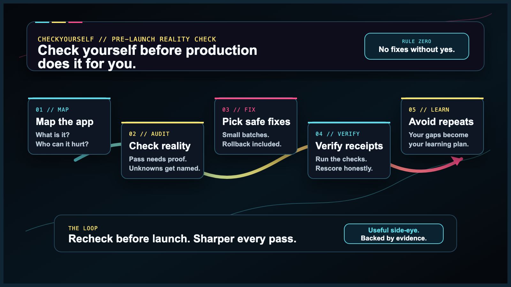
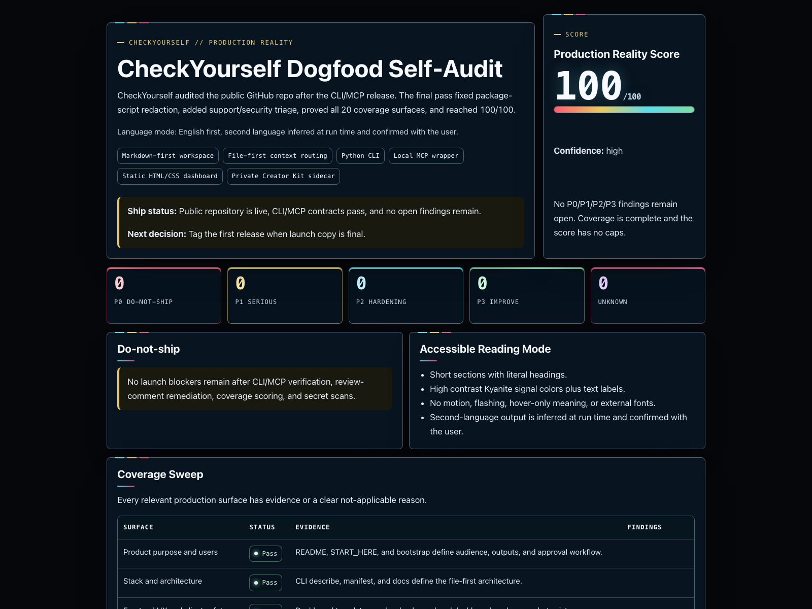

# CheckYourself

> **Check yourself before you wreck yourself.** A pre-launch reality check for AI-built apps.

[](LICENSE)
[](#works-with-your-ai-tool)
[](#safety-model)
[](#local-cli-and-mcp)

CheckYourself is a free, open-source audit system that turns your AI assistant into a pre-launch production reviewer.

It maps your app, checks the places AI-built projects usually get humbled, gives you a 0-100 Production Reality Score, ranks every finding, suggests the safest first fixes, and builds a learning plan from the exact gaps in your project.

It is not a linter with a clipboard. It is not a shame machine. It is a calm, evidence-first second opinion with just enough side-eye to keep your launch honest.

No SaaS. No account. No model lock-in. No code changes unless you approve them.

## Quick Start

1. Put the `checkyourself` folder inside or next to your project.
2. Point your AI coding assistant at [`CONTEXT.md`](CONTEXT.md).
3. Ask for a read-only diagnostic.
4. Review the score, findings, backlog, and safest first fix batch.
5. Approve fixes one batch at a time.
6. Recheck, rescore, and learn what to avoid next time.

Use this prompt:

```text
Use the checkyourself folder as your operating context.
Start with a read-only diagnostic.
Do not change code until I approve a specific fix.
Generate the dashboard only if I say dashboard yes.
After the diagnostic, create a learning plan based on the gaps you found.
```

## How It Works



CheckYourself moves in a loop:

1. **Map the app** - infer what it is, who it serves, and what stack it uses.
2. **Check reality** - sweep the production risk surfaces with evidence.
3. **Pick the safest fix** - rank the backlog by harm, reversibility, and learning value.
4. **Verify the receipts** - run the checks that prove the fix actually helped.
5. **Learn what to avoid next time** - turn the gaps into a practical learning plan.

Then it rechecks before launch, because vibes are not a deployment strategy.

## What You Get

- **Production Reality Report** - plain-English diagnosis, detected stack, score, unknowns, findings, evidence, and backlog.
- **Production Reality Score** - 0-100, with severity caps so serious risk cannot hide behind nice polish.
- **Complete Findings Register** - not just the first three obvious problems.
- **Safest First Fix Batch** - a small approval-ready batch with verification and rollback notes.
- **Guided Fix Loop** - approve, fix, verify, rescore, repeat.
- **Bespoke Learning Plan** - practical next lessons tied to your actual app, with trusted sources and relevant videos when available.
- **Optional Dashboard** - a self-contained HTML/CSS view, or a compact inline Markdown version when tokens matter.

See a sample report in [`samples/sample-production-reality-report.md`](samples/sample-production-reality-report.md).

## Dashboard Preview

This is the real CheckYourself dogfood dashboard from CheckYourself auditing itself:



The dashboard is optional. The Markdown report stays the source of truth because it is cheaper, easier to diff, and easier for agents to update.

To request the visual dashboard after a report exists:

```text
dashboard yes
```

For the lower-token version:

```text
dashboard inline
```

Dashboard docs live in [`10_DASHBOARD/`](10_DASHBOARD/README.md).

## What It Checks

CheckYourself looks for launch trouble across the surfaces that matter:

- product purpose, users, and harm model;
- frontend UX, accessibility, and client safety;
- backend/API behavior, validation, uploads, and webhooks;
- auth, permissions, sessions, roles, and admin paths;
- data storage, migrations, backups, and tenant/user isolation;
- secrets, environment variables, and runtime configuration;
- tests, quality gates, and regression coverage;
- CI/CD, dependencies, supply chain, and release safety;
- deployment, rollback, hosting, and environments;
- observability, logs, errors, alerts, and incident response;
- performance, scaling, caching, and rate limits;
- privacy, compliance, retention, and consent;
- AI/RAG/agent governance when applicable.

The advanced hardening library is in [`90_ADVANCED/`](90_ADVANCED/). You do not need to read it first; agents load it only when a finding needs deeper guidance.

## Works With Your AI Tool

CheckYourself is plain Markdown plus a small optional Python CLI, so it works with tools that can read text or project files:

| Category | Examples |
| --- | --- |
| AI IDEs and editors | Cursor, Windsurf, GitHub Copilot, Codex |
| Chat assistants | ChatGPT, Claude, Gemini |
| App builders | Replit, Lovable, Bolt |
| Local and custom agents | any local model or agent that reads files |

Tool-specific setup guides live in [`06_ADAPTERS/`](06_ADAPTERS/README.md).

## Local CLI And MCP

The folder workflow is the main product. The CLI is the deterministic engine for agents, CI, and local receipts:

```bash
python3 tools/checkyourself.py /path/to/your/project
```

It detects stack signals, flags obvious deterministic risks, writes a prefilled context file, emits schemas, checks coverage, computes the score, ranks the backlog, and exposes a thin MCP wrapper:

```bash
python3 tools/checkyourself.py describe --format json
python3 tools/checkyourself.py . --format json --no-write
python3 tools/checkyourself.py coverage --emit --format json
python3 tools/checkyourself.py score --findings CHECKYOURSELF_SCAN.generated.json --format json
python3 tools/checkyourself.py . --ci
python3 tools/checkyourself.py mcp
```

The CLI does not replace the full diagnostic. It handles deterministic work so your AI can spend its attention on judgment.

Read [`docs/cli.md`](docs/cli.md) for the command reference and [`docs/mcp.md`](docs/mcp.md) for MCP setup. There is no hosted API unless CheckYourself becomes a service product with accounts, shared history, hosted runs, or billing.

## Personality

CheckYourself has a point of view:

- **Receipts over reassurance.** A pass needs evidence.
- **Roast-lite agent voice.** The side-eye is built into `AGENTS.md` and the chat bootstrap: one sharp reality check, then evidence, impact, fix, verification.
- **Small fixes beat heroic rewrites.** The safest batch goes first.
- **Learning is part of the product.** If your app had the gap, your plan explains the gap.
- **Accessible by default.** Short sections, literal labels, high contrast, no motion-dependent meaning, and runtime language support when the user wants it.

The vibe is: a launch coach, a security-minded friend, and a code reviewer who knows when to say, "Not yet. Here is why."

## Safety Model

CheckYourself starts read-only.

It inspects, explains, ranks, and recommends before touching code. Fixes require explicit approval, stay small and reversible, include verification, and update the score only after evidence changes.

For regulated, financial, health, legal, life-safety, security-critical, or high-volume systems, CheckYourself should recommend qualified expert review. It is a strong pre-launch pass, not a substitute for professional accountability.

## Support And Security

Use [SUPPORT.md](SUPPORT.md) for bugs, docs gaps, CLI/MCP problems, accessibility issues, and stale examples.

Use [SECURITY.md](SECURITY.md) for vulnerability handling. Do not post live secrets, customer data, proprietary code, or unredacted `.env` values in public issues.

## FAQ

### Is CheckYourself a prompt?

No. It includes prompts, but the product is a staged audit workspace: rules, context files, scoring, templates, schemas, examples, dashboard support, an optional CLI, and an advanced hardening library.

### Do I need the command line?

No. The CLI is optional. File-aware AI tools can start at [`CONTEXT.md`](CONTEXT.md). Chat-only tools can use [`PASTE_THIS_INTO_YOUR_AI.md`](PASTE_THIS_INTO_YOUR_AI.md).

### Is it free?

Yes. CheckYourself is MIT licensed.

### Is it affiliated with any specific AI model or IDE?

No. It is model-agnostic and tool-agnostic.

### How is it different from a linter?

Linters catch style and narrow code issues. CheckYourself asks whether the app is actually ready to face users, data, auth, deploys, failures, privacy, and production pressure.

## Contributing

Issues and pull requests are welcome. See [`CONTRIBUTING.md`](CONTRIBUTING.md) and [`CHANGELOG.md`](CHANGELOG.md).

## License

MIT. See [`LICENSE`](LICENSE).
